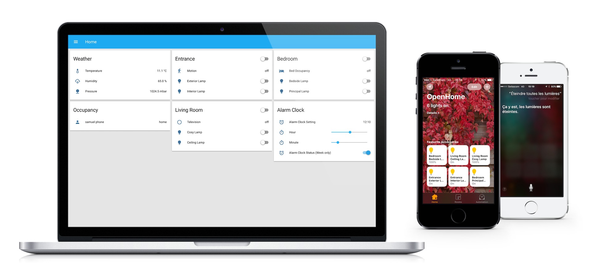
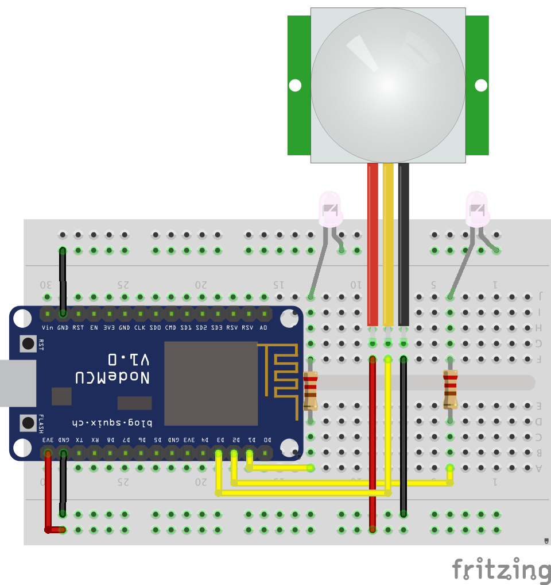
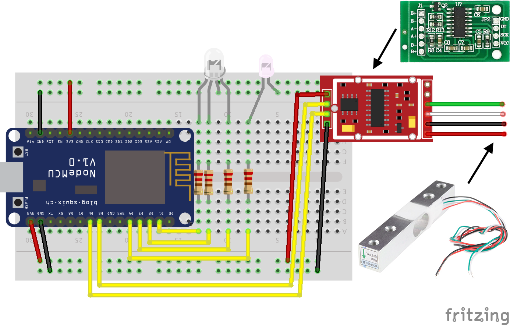
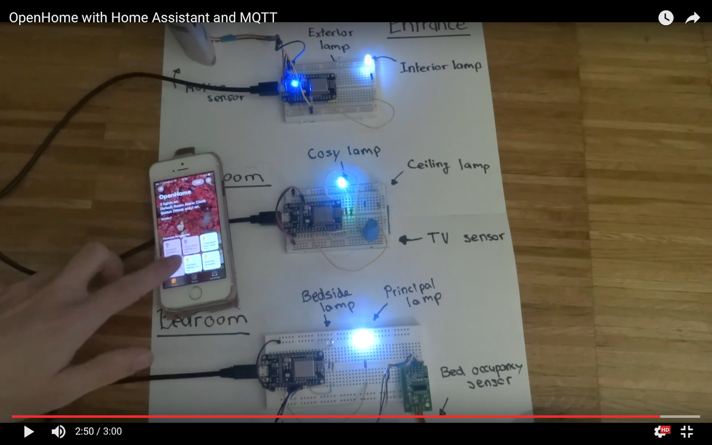

# HOME AUTOMATION WITH OPEN HARDWARE AND SOFTWARE


## Table of contents
1. [Introduction](#introduction)
2. [Automation](#automation)
3. [Parts list](#partslist)
4. [Installation of the controller](#installationofthecontroller)
5. [Installation of the extra components for Home Assistant](#installationoftheextracomponentsforhomeassistant)
6. [Implementation of the actuators/sensors](#implementationoftheactuators/sensors)
7. [Creation of the automation rules](#creationoftheautomationrules)
8. [Demonstration](#demonstration)


## Introduction
### Context
### Architecture

## Automation

## Parts list
### Hardware
### Software

## Installation of the controller
### Home Assistant
To install Home Assistant easily, a Raspberry Pi All-In-One Installer is available [here](https://home-assistant.io/getting-started/installation-raspberry-pi-all-in-one/). More recently, a Raspberry Pi image was released [here](https://home-assistant.io/blog/2016/10/01/we-have-raspberry-image-now/). This image comes pre-installed with everything we need to get started with Home Assistant. For this project, we just need Home Assistant and the Mosquitto MQTT broker, so I prefer to install everything manually.

First, we need to update the system and install some Python dependencies.

```
sudo apt-get update
sudo apt-get upgrade
sudo apt-get install python-pip python3-dev
sudo pip install --upgrade virtualenv
```

Then, we create a new system user, `hass`, to execute the service for Home Assistant. This is a good practice to reduce the exposure of the rest of the system and provide a more granular control over permissions.

```
sudo adduser --system hass
```

We create a new directory for Home Assistant and we change its ownership to the new created user.

```
sudo mkdir /srv/hass
sudo chown hass /srv/hass
```
We become the new user and we set up a virtual Python environment in the directory we just created. A virtual Python environment is a good practice to avoid interaction with the Python packages used by the system or by others applications. Then, we activate it.

```
sudo su -s /bin/bash hass
virtualenv -p python3 /srv/hass
source /srv/hass/bin/activate
```
And now we are ready to install Home Assistant.

```
pip3 install --upgrade homeassistant
```
Finally we can run Home Assistant by typing the command below.

```
sudo -u hass -H /srv/hass/bin/hass
```

For starting Home Assistant on boot, we need to create a service for `systemd`. Someone has already created one and we can just download it.

```
sudo wget https://raw.githubusercontent.com/home-assistant/home-assistant/master/script/home-assistant%40.service -O /etc/systemd/system/home-assistant@hass.service
```

This service needs a little modification. We have to replace `/usr/bin/hass`with `/srv/hass/bin/hass`. The line in question should look like this now `ExecStart=/srv/hass/bin/hass --runner`.

```
sudo nano /etc/systemd/system/home-assistant@hass.service
```

We need to reload `systemd`to make the daemon aware of the new configuration.

```
sudo systemctl --system daemon-reload
sudo systemctl enable home-assistant@hass
sudo systemctl start home-assistant@hass
```

To upgrade the system in the future, we just need to type the commands below.

```
sudo su -s /bin/bash hass
source /srv/hass/bin/activate
pip3 install --upgrade homeassistant
```

If HTTPS is used (link below), we need to add the following lines into the `configuration.yaml`file.

``` yaml
http:
  api_password: '[REDACTED]'
  ssl_certificate: '/etc/letsencrypt/live/[REDACTED]/fullchain.pem'
  ssl_key: '/etc/letsencrypt/live/[REDACTED]/privkey.pem'
```

Important files

- Configuration file: `/home/hass/.homeassistant/configuration.yaml`
- Logs file: `/home/hass/.homeassistant/home-assistant.log`

The entire configuration is available [here](configuration/home_assistant).

Optional steps:

- Allow a remote access to Home Assistant and protect the GUI with HTTPS ([here](https://home-assistant.io/blog/2015/12/13/setup-encryption-using-lets-encrypt/)).
- Use Tor to make remote access anonymous ([here](https://home-assistant.io/cookbook/tor_configuration/)).

Sources:

- [Installation in Virtualenv](https://home-assistant.io/getting-started/installation-virtualenv/)
- [Autostart Using Systemd](https://home-assistant.io/getting-started/autostart-systemd/)

### Mosquitto MQTT broker
To install the latest version of Mosquitto, we need to use their new repository.

```
wget http://repo.mosquitto.org/debian/mosquitto-repo.gpg.key
sudo apt-key add mosquitto-repo.gpg.key
```

Then we make the repository available to apt and update its informations.

```
cd /etc/apt/sources.list.d/
sudo wget http://repo.mosquitto.org/debian/mosquitto-jessie.list
sudo apt-get update
```

Finally we can install Mosquitto and its client, for testing purpose.

```
sudo apt-get install mosquitto mosquitto-clients
```

The MQTT protocol provides authentication and ACL functionalities to protect its use.
To create a username/password, we just need to use `mosquitto_passwd`.

```
cd /etc/mosquitto/conf.d/
sudo touch pwfile
sudo mosquitto_passwd pwfile ha
```

And to restrict publishing/subscribing, we need to create a `aclfile`, in which we specify the username and the relevant MQTT topics.

```
cd /etc/mosquitto/conf.d/
sudo touch aclfile
```

ACL examples:

```
user ha
topic write entrance/light1/switch topic write entrance/light2/switch
...
topic read entrance/light1/status
topic read entrance/light2/status
```

If MQTT over TLS (link below), username/password and ACL are used, we need to add the following lines into the `mosquitto.conf`file.

```
allow_anonymous false
password_file /etc/mosquitto/conf.d/pwfile
acl_file /etc/mosquitto/conf.d/aclfile
listener 8883 (optional)
cafile /etc/mosquitto/certs/ca.crt (optional)
certfile /etc/mosquitto/certs/raspberrypi.crt keyfile /etc/mosquitto/certs/raspberrypi.key (optional)
```

To link Home Assistant with the Mosquitto broker, the `configuration.yaml`file needs the lines below.

```yaml
mqtt:
  broker: 'localhost' #127.0.0.1
  port: 8883 #1883
  client_id: 'ha'
  username: 'ha'
  password: '[REDACTED]' (optional)
  certificate: '/etc/mosquitto/certs/ca.crt' (optional)
```

Important files:

- Configuration file: `/etc/mosquitto/conf.d/mosquitto.conf`
- Logs file: `/var/log/mosquitto/mosquitto.log`

The entire configuration is available [here](configuration/mosquitto).

Optional step:

- Protect MQTT over a secure TLS connection ([here](http://owntracks.org/booklet/guide/broker/)).

Source:

- [Mosquitto Debian repository](https://mosquitto.org/2013/01/mosquitto-debian-repository/
).

### Homebridge
The installation of Homebridge is not mandatory. Homebridge runs on Node.js and this language needs to be installed. A good tutoriel is available [here](https://blog.wia.io/installing-node-js-on-a-raspberry-pi-3). The installation of Homebridge on a Raspberry Pi is well documented [here](https://github.com/nfarina/homebridge/wiki/Running-HomeBridge-on-a-Raspberry-Pi). To link Homebridge and Home Assistant, a plugin is required. The plugin and the installation instructions are available [here](https://github.com/home-assistant/homebridge-homeassistant).

At the end, the Homebridge bridge should be visible inside Apple's Home application.
## Installation of the extra components for Home Assistant
### Telegram
Configuration for Home Assistant:

```yaml
notify:
platform: telegram
api_key: [Redacted]
chat_id: [Redacted]
```
### Forcast.io
Configuration for Home Assistant:
```yaml
sensor:
  platform: forecast
  api_key: [Redacted]
  monitored_conditions:
    - precip_probability
    - temperature
    - wind_speed
    - cloud_cover
    - humidity
    - pressure
    - temperature_max
    - precip_intensity_max
```
### Owntracks
Configuration for Home Assistant:

```yaml
device_tracker:
  platform: owntracks
```
Configuration for the Owntracks application:

## Implementation of the actuators/sensors
The sketches are available [here](sketches). Before using them, we need to modify the Wi-Fi SSID/password, the MQTT username/password, the desired IP address ant the OTA password. The use of TLS is optional.

```C
// Wi-Fi: Access Point SSID and password
const char*       AP_SSID           = "[Redacted]";
const char*       AP_PASSWORD       = "[Redacted]";
...
const char*       MQTT_USERNAME     = "entrance";
const char*       MQTT_PASSWORD     = "[Redacted]";
...
// TLS: The fingerprint of the MQTT broker certificate (SHA1)
#ifdef TLS
// openssl x509 -fingerprint -in  <certificate>.crt
const char*       CA_FINGERPRINT    = "[Redacted]";
// openssl x509 -subject -in  <certificate>.crt
const char*       CA_SUBJECT        = "[Redacted]";
#endif
...
const char*       OTA_PASSWORD      = "[Redacted]";
```

### Entrance
Schematic:

Configuration for Home Assistant

```yaml
light:
    # lamp 1
  - platform: mqtt
    name: 'Lamp 1'
    state_topic: 'entrance/light1/status'
    command_topic: 'entrance/light1/switch' optimistic: false
    # lamp 2
  - platform: mqtt
    name: 'Lamp 2'
    state_topic: 'entrance/light2/status'
    command_topic: 'entrance/light2/switch' optimistic: false
  
binary_sensor:
  platform: mqtt
  name: 'Motion'
  state_topic: 'entrance/door/motion/status'
  sensor_class: motion
```
### Living room
Schematic:

Configuration for Home Assistant:

```yaml
light:
    # lamp 3 (RGB)
  - platform: mqtt
    name: 'Lamp 3'
    state_topic: 'livingroom/light1/status'
    command_topic: 'livingroom/light1/switch'
    brightness_state_topic: 'livingroom/light1/brightness/status' 
    brightness_command_topic: 'livingroom/light1/brightness/set'
    rgb_state_topic: 'livingroom/light1/color/status'
    rgb_command_topic: 'livingroom/light1/color/set'
    optimistic: false
  
    # lamp 4
  - platform: mqtt
    name: 'Lamp 4'
    state_topic: 'livingroom/light2/status'
    command_topic: 'livingroom/light2/switch'
    optimistic: false
 
binary_sensor:
  platform: mqtt
  name: 'TV'
  state_topic: 'livingroom/tv/status'
```
### Bedroom
Schematic:

Configuration for Home Assistant:

```yaml
light:
    # lamp 5 (RGB)
  - platform: mqtt
    name: 'Lamp 5'
    state_topic: 'bedroom/light1/status'
    command_topic: 'bedroom/light1/switch'
    brightness_state_topic: 'bedroom/light1/brightness/status'     
    brightness_command_topic: 'bedroom/light1/brightness/set'
    rgb_state_topic: 'bedroom/light1/color/status'
    rgb_command_topic: 'bedroom/light1/color/set'
    optimistic: false
    # lamp 6
  - platform: mqtt
    name: 'Lamp 6'
    state_topic: 'bedroom/light2/status'
    command_topic: 'bedroom/light2/switch'
    optimistic: false

binary_sensor:
  platform: mqtt
  name: 'Occupancy'
  state_topic: 'bedroom/bed/occupancy/status' sensor_class: occupancy
```
## Creation of the automation rules
### Entrance
### Living room
### Bedroom
### Presence simulation

## Demonstration
Features:

- Change the lightning when the TV is switched on or off
- Simulate the sunrise when the alarm clock rings
- Simulate the sunset when the person is going to bed
- Simulate a presence when nobody is at home
- Control the system with Apple Home applicatioin and Siri

[](https://www.youtube.com/watch?v=Vh-vzFPCF2U "OpenHome with Home Assistant and MQTT")
